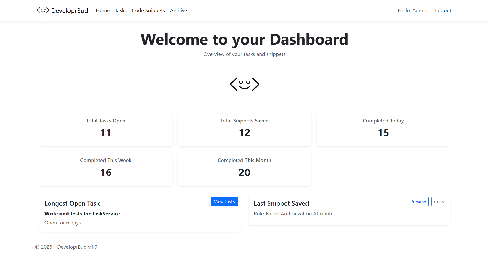
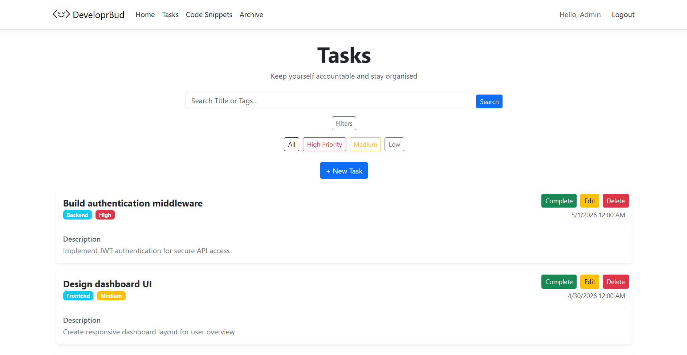
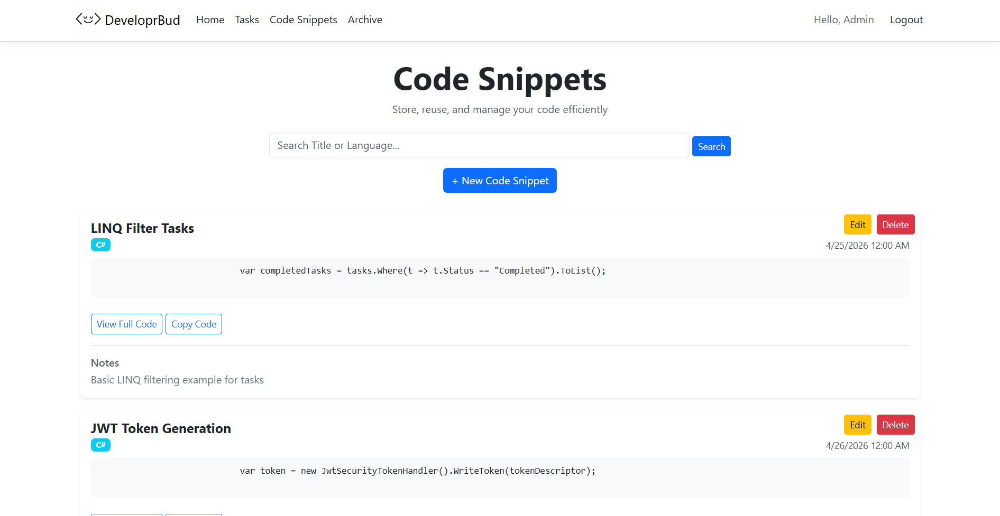
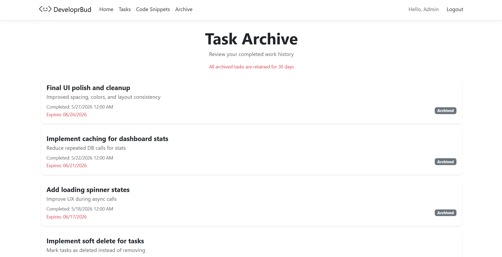

# DeveloprBud

DeveloprBud is a productivity web application built for developers of all experience levels to manage development tasks and store reusable code snippets. It helps developers stay organized, track progress, and maintain a personal library of useful code references.

---

## Features

### 📊 **Dashboard**
Provides developer accountability and productivity insights, including:
- Tasks completed today, this week, and this month
- Total code snippets saved
- Most recently saved snippet
- Longest open task
- Overview of productivity trends

### 🗂️ **Task Management**
- Create, edit, delete, and complete tasks
- Track development progress over time
- Organize tasks using priority and tags

### 💻 **Code Snippet Management**
- Create, edit, and delete code snippets
- Copy snippets instantly for reuse
- Store useful code for future reference

### 📦 **Task Archive**
- View completed tasks
- Automatically stores tasks completed within the last 30 days
- Keeps workspace clean while preserving recent history

---

## 🛠️ Tech Stack

- ASP.NET Core Razor Pages
- Entity Framework Core
- SQL Server LocalDB
- ASP.NET Identity (Authentication)
- Bootstrap
- CSS
- JavaScript (copy-to-clipboard functionality)

---

## 🚀 Setup Instructions

> [!IMPORTANT]
> Required Resources to run:
> Visual Studio 2022 (or newer) / .NET SDK

1. Clone the repository:
```bash
git clone https://github.com/yourusername/DeveloprBud.git
```
2. Open App in Visual Studio > Package Manager Console
3. Run:
```
Update-Database
```
4. Run Application

---
## Developer Notes:
Current App Version: v1.0
- v2.0 Features - (Future Addon to Project)
  - Developer Log for tracking project progress
  - Toast Messages when tasks/snippets are added/deleted/completed
  - Code formatting + highlighting
  - Light / Dark Mode + Different color options
  - Potential Web Hosted App

# Screenshots
### Dashboard

<br>
### Tasks

<br>
### Code Snippets

<br>
### Tasks Archive

