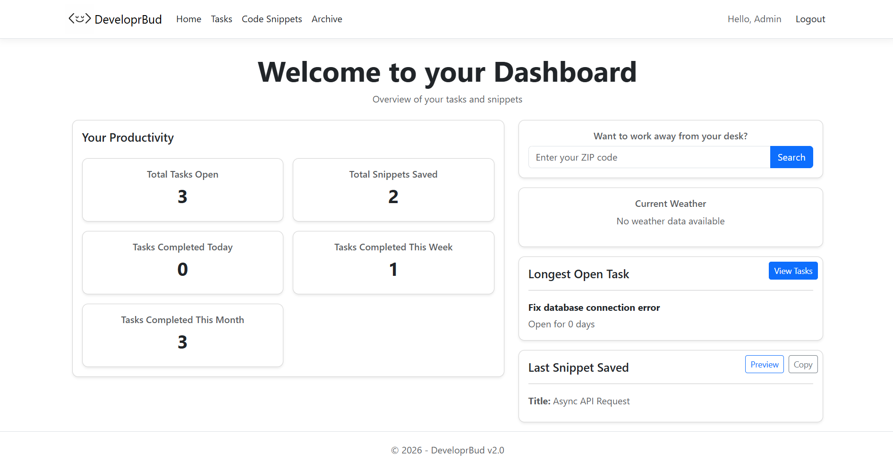
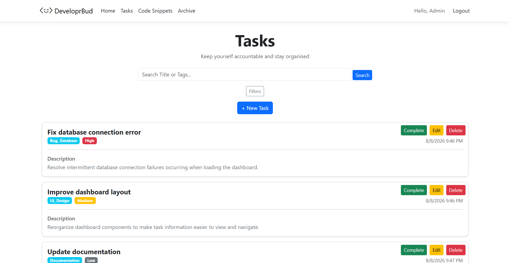
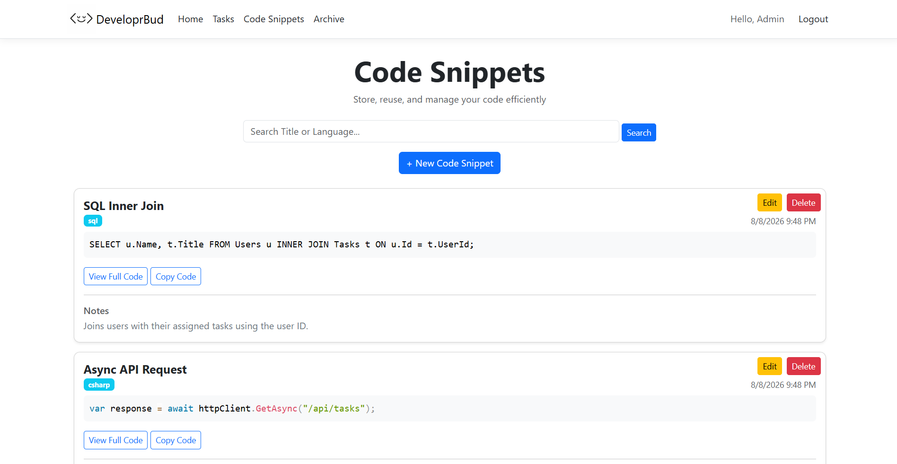
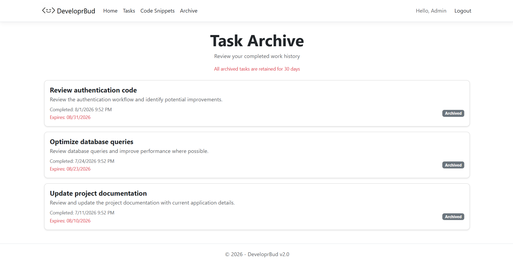

# 🚀 DeveloprBud

DeveloprBud is a developer-focused productivity web application designed to help developers stay organized, manage development tasks, and build a personal library of reusable code snippets.

DeveloprBud combines **task management, productivity insights, and code snippet management** into one workspace.

## 🌐 Live Demo

[**Launch DeveloprBud**](https://developrbud-bdbferhbb3ewd4hp.centralus-01.azurewebsites.net/)

> [!NOTE]
> **Deployment Note:** The live demo is hosted on Azure using serverless/free-tier resources. After periods of inactivity, the database may need a few moments to resume, so the initial page load can take longer than usual. If the page appears to stall, please refresh the browser.

---

## ✨ Features

### 📊 Dashboard

The dashboard provides an at-a-glance view of development activity and productivity, including:

- Tasks completed today, this week, and this month
- Total code snippets saved
- Most recently saved code snippet
- Longest open task
- Productivity insights and activity trends
- Weather information for users working remotely

### 🗂️ Task Management

- Create, edit, and delete tasks
- Mark tasks as completed
- Assign priority levels to tasks
- Organize tasks using tags
- Track task creation and completion dates
- View and manage development tasks from the dashboard

### 💻 Code Snippet Management

- Create, edit, and delete code snippets
- Organize snippets by programming language
- Copy code snippets with one click
- Add notes and descriptions to snippets
- Syntax-highlighted code previews with PrismJS
- Live in-browser code editing with Ace Code Editor
- Dynamic syntax highlighting based on the selected programming language

### 📦 Task Archive

- View recently completed tasks
- Automatically archive completed tasks based on their completion date
- Preserve recent task history while keeping the active workspace organized

### 🔔 User Feedback

- Toast notifications for creating, editing, and deleting tasks and snippets
- Confirmation feedback when copying code snippets
- User-friendly feedback for completed actions

---

## 🛠️ Tech Stack

### Backend

- C#
- ASP.NET Core Razor Pages
- Entity Framework Core
- SQL Server
- ASP.NET Identity

### Frontend

- HTML
- CSS
- Bootstrap
- JavaScript
- PrismJS
- Ace Code Editor

### APIs & Tools

- Weather API
- NuGet
- Visual Studio 2022
- Git / GitHub
- Microsoft Azure

---

## 🚀 V2 Release

DeveloprBud V2 introduces a redesigned dashboard, improved user feedback, developer-focused code editing capabilities, and additional productivity features.

### What's New

- Weather API integration for users working remotely
- Redesigned dashboard with a more condensed UI and improved workflow
- Toast notifications for tasks and code snippets
- PrismJS syntax highlighting for code previews
- Ace Code Editor integration for creating and editing code snippets
- Dynamic syntax highlighting based on the selected programming language
- Live Demo Deployed Web Application hosted on Azure

---

## 📸 Screenshots

### Dashboard



<br>

### Tasks



<br>

### Code Snippets



<br>

### Tasks Archive



---

## 🚀 Local Machine Setup Instructions

> [!IMPORTANT]
> **Required Resources**
> - Visual Studio 2022 or newer
> - .NET SDK
> - SQL Server LocalDB

### 1. Clone the Repository

```bash
git clone https://github.com/json-moore/DeveloprBud.git
